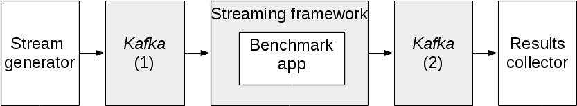
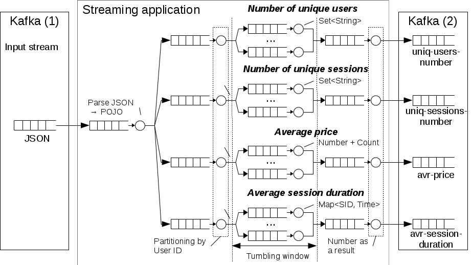

# Big data streaming benchmark (template)

## Introduction
Streaming frameworks for big data processing are used in many business applications
which are getting data from Internet users. Typical business application
architecture of an Internet company often includes different mobile applications,
web applications and multi level server side applications.
We can separate client-server interactions by criteria of one or two direction
communication as request-response and one direction information messages.
Typical way for organizing of request-response schema is to use protocols
based on REST or SOAP.

Let that an Internet company is interested to know all about user's activity.
It includes information about which mobile games are interested for users,
what is typical algorithm of applications usage, how long a user works with an
application. That is mobile application generates a stream of data,
which may be used for further analysis of popularity of the applications,
popular sections of the applications, may be used for targeting of sales etc.

## Benchmark architecture
Typical schema of testing of a streaming benchmark is presented at the following figure.

Kafka(1) and Kafka(2) are input and output message queues. 
Sometimes they can be excluded or functionality of Kafka may be replaced by a streaming framework self. 


When we speak about a streaming benchmark like a real business application we 
have to consider whole chain of data processing from generation to results 
collecting. So the benchmarks consists on "Stream generator" which is provides
appropriate dynamic loading, "Benchmark app" which is emulate general business 
logic of the real application and results collector which provides correct results 
gathering and features estimation. The only changeable part which is depend 
on different streaming benchmarks is "Benchmark app". This part is implemented 
in term of a concrete streaming framework.

The base of the benchmark we are using Peel framework with additional streming extensions
for running of streaming applications. Primary it is a framework for running of
repeatable tests for batch tasks. But main differences with streaming applications
are stream generation module and stream application runners.


At the point of view business application we are considering activity of some 
Internet base company with mobile application which send current activity data 
to servers. Let the input format is JSON. Mobile applications generate a stream 
with up to 100 000 messages per second. We will provide minimal information about 
a user like user identifier, session identifier, IP-address, price of a purchase 
of something. All data we are splitting by timed windows. And we are implementing 
following testing operation: calculation of average number of users, number of 
session, average price of a purchase and average session duration. 
We are implementing 3 different streaming applications for Apache Storm Trident, 
Apache Flink and Apache Spark Streaming. All applications are implemented 
in same declarative style in Java. Internal architecture of the application 
is presented at following figure.


In this architecture we are receiving input stream from Kafka (1) and parsing 
it from JSON to a streaming framework's specific Java object. Next phase is data 
partitioning for each operation separately. It is allow to process aggregation  
over windows independently. It is important due to allow to check behaviour of 
a streaming framework in different loading modes. We are providing 3 aggregation 
operations that build 4 channels of data processing. For each aggregation 
operation we are using automatic partitioning and tumbling windows with same 
fixed duration. For each partition there is own statefull aggregation operator 
implemented as a custom class. That is technically there is common for all 
frameworks problem of state saving and limitation of RAM. Each time interval 
partial aggregates are are collected by separate partitions are reduced by 
output operation which produce final number depending of input criteria and 
push data into appropriate output Kafka (2) topics. As a possible improvement 
of the streaming applications in this schema is preliminary data partitioning 
of input JSON topic and further data processing on same computational nodes 
as data stored. But this mode require deep optimization for each streaming 
framework. At the same time current implementation of the applications 
delegates task of partitioning directly to streaming frameworks.

Main monitoring features are latency and throughput. 
Let latency as a time between a message entrance into a streaming application 
and final aggregation calculation through windowed data. As we are considering 
aggregation operation per window we will speak about an average value of the 
latency. Throughput is a number of processed messages per second for this 
testing operation.

There are changable parameters:
* parameters related with stream generator stream generation including number of messages per time, number of threads for generation, number of instances of data generator;
* parameters related with size of data for state full aggregation operations programming including number of users, number of sessions, percentage of variable sessions for each user, percentage of messages with purchases, windows sizes for data analysis;
* number of partitions for aggregation operations;
* topology of the benchmarks, number of testing framework's modules.

## Prerequisits

* JDK 8
* maven

Any other software will be downloaded automatically.

This benchmark prepared with [Peel Framework](http://peel-framework.org/) and extends streaming benchmarking.
For more information see [Peel Manual](http://peel-framework.org/manual) for more information how to build and run the experiments bundled in this package.

There are benchmarking applications for Apache Storm/Trident, Apache Spark and Apache Flink.


## How to build

Run ./build.sh

This benchmark based on Peel Framework. The result of building is a standalone
 directory with all binary assemblies. By default this directory is `~/bundles/bin`

## How to run

Use Peel related commands.

There are tree configuration for Apache Flink, Apache Spark and Apache Storm. 
See `~/bundles/bin/yauza-benchmark/config/fixtures/systems.scala` and `~/bundles/bin/yauza-benchmark/config/fixtures/benchmark.scala` 
after installation. Or see sources [systems](yauza-benchmark-bundle/src/main/resources/config/fixtures/systems.scala) and [benchmark description](yauza-benchmark-bundle/src/main/resources/config/fixtures/benchmark.scala).


Run all experiments on single node:

`./peel.sh suite:run benchmark.default`


Run all experiments in cluster mode:

`./peel.sh suite:run benchmark.scale-out`

Note, for running cluster mode you have to prepare hardware configuration of the cluster. See see [Peel Manual](http://peel-framework.org/manual)


Run only specified experiments:

`./peel.sh exp:config benchmark.default benchmark.flink.default`


Looking of configuration for specified experiment:

`./peel.sh exp:config benchmark.default benchmark.flink.default`

## Results processing
All log files of the Peel framework are placed in `~/bundles/bin/yauza-benchmark/results` with a name of directory which is
completely appropriate to the name of the suite and contains subdirs with names of experiments. See example:
```
benchmark.default
    benchmark.flink.default.run01
    benchmark.flink.default.run02
    benchmark.flink.default.run03
    benchmark.spark.default.run01
    benchmark.spark.default.run02
    benchmark.spark.default.run03
    benchmark.storm.default.run01
    benchmark.storm.default.run02
    benchmark.storm.default.run03
```

Results of processing of streaming applications are placed into output Kafka topic.
And finally these results are processing by a Peel extension with a [results collector](yauza-benchmark-peelextensions/src/main/scala/yauza/benchmark/ResultsCollector.scala)

These results are placed into top level of the results's directory and have names like:
```
results-benchmark.flink.default.run01.json
results-benchmark.flink.default.run02.json
results-benchmark.flink.default.run03.json
results-benchmark.spark.default.run01.json
results-benchmark.spark.default.run02.json
results-benchmark.spark.default.run03.json
results-benchmark.storm.default.run01.json
results-benchmark.storm.default.run02.json
results-benchmark.storm.default.run03.json
```
To process these data you can use an [appropriate Ruby-script](utils/results_proc.rb). Run it like `./results_proc.rb results-benchmark.flink.default.run02.json`

For each experiment there is statistics collected by dstat.
Example: `/results/benchmark.default/benchmark.flink.default.run02/logs/dstat/dstat-0.7.2/dstat-rss-linux-nkjy.csv`

There is [shee utility](https://github.com/spi-x-i/shee) for drawing of aggregation pictures for network, CPU, memory resources.

## Development
All streaming applications and data generator are implemented in Java. Code of extensions for Peel is implemented in Scala.

Project structure:

| Directory | Comment |
|-------------------------------|-------------------------|
| yauza-benchmark-bundle        | Peel related files and configurations. See [config path](yauza-benchmark-bundle/src/main/resources/config)|
| yauza-benchmark-common        | Common Java classes for the applications.|
| yauza-benchmark-datagens      | Stream generator classes.|
| yauza-benchmark-flink-jobs    | Streaming application for Flink. Java classes.|
| yauza-benchmark-peelextensions| Peel extension for running streaming frameworks in appropriate mode. Peel Framework primary oriented to batch processing therefore this extension additionally overlaps standard monitoring modes of the Peel. |
| yauza-benchmark-spark-jobs    | Streaming application for Spark. Java classes.|
| yauza-benchmark-storm-jobs    | Streaming application for Storm/Trident. Java classes.|

For running of an experiment in debugger specify following parameters in your IDE:
```
Main class: org.peelframework.core.cli.Peel
Program arguments: exp:run benchmark.default benchmark.spark.default
Working directory: .../bundles/bin/yauza-benchmark 
    (this directory is creted after running of ./build.sh script)
Class path: yauza-benchmark-peelextensions
```
